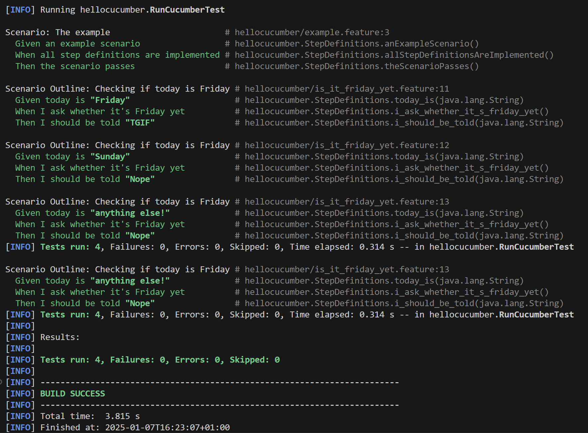
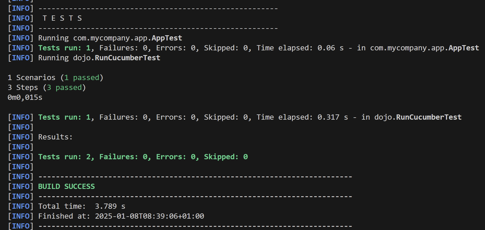
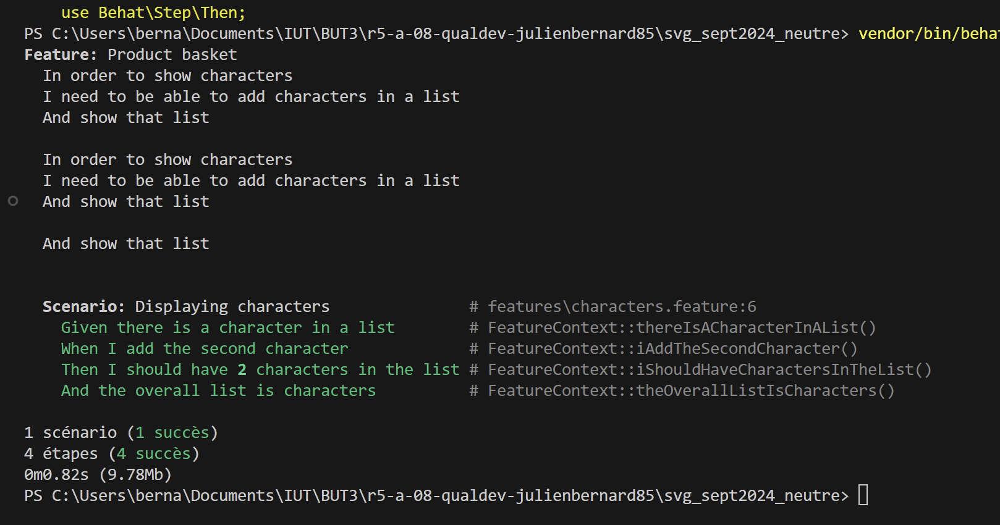

= R5.A.08 -- Dépôt pour les TPs
:icons: font
:MoSCoW: https://fr.wikipedia.org/wiki/M%C3%A9thode_MoSCoW[MoSCoW]

Ce dépôt concerne les rendus de mailto:A_changer@etu.univ-tlse2.fr[Jonh Doe].

== TP1

Feature: Is it Friday yet?
  Everybody wants to know when it's Friday

  Scenario Outline: Checking if today is Friday
    Given today is "<day>"
    When I ask whether it's Friday yet
    Then I should be told "<answer>"

    Examples:
      | day            | answer |
      | Friday         | TGIF   |
      | Sunday         | Nope   |
      | anything else! | Nope   |
---

.Build Success

== TP2

package dojo;

import java.util.Collections;
import java.util.List;

class Order {

    void declareOwner(String from) {
        from = "romeo";
    }

    void declareTarget(String to) {
        to = "juliette";
    }

    List<String> getCocktails() {
        return Collections.emptyList();
    }
}

---

.Build Success

--- 

== TP3

Pour ce projet, j'ai voulu tester l'ajout de personnage dans une liste afin de simuler l'ajout des personnages des histoires du site.

Feature: Product basket
  In order to show characters
  I need to be able to add characters in a list
  And show that list

  Scenario: Displaying characters
    Given there is a character in a list
    When I add the second character
    Then I should have 2 characters in the list
    And the overall list is characters

=== Les steps

==== FeatureContext.php

<?php

use Behat\Behat\Context\Context;
use Behat\Behat\Tester\Exception\PendingException;
use PHPUnit\Framework\Assert; // Assurez-vous d'importer PHPUnit pour les assertions

/**
 * Defines application features from the specific context.
 */
class FeatureContext implements Context
{
    /**
     * @var Characters
     */
    private $character_list;

    /**
     * Initializes context.
     *
     * Every scenario gets its own context instance.
     */
    public function __construct()
    {
        $this->character_list = new Characters();
    }

    /**
     * @Given there is a character in a list
     */
    public function thereIsACharacterInAList(): void
    {
        // Déclarez un personnage dans la liste
        $this->character_list->declareCharacter("Character 1");
    }

    /**
     * @When I add the second character
     */
    public function iAddTheSecondCharacter(): void
    {
        // Ajoutez un deuxième personnage à la liste
        $this->character_list->addToList("Character 2");
    }

    /**
     * @Then I should have :arg1 characters in the list
     */
    public function iShouldHaveCharactersInTheList(int $arg1): void
    {
        $characters = $this->character_list->getCharacters();

        // Vérifiez que la taille de la liste correspond à l'argument
        Assert::assertCount($arg1, $characters);
    }

    /**
     * @Then the overall list is characters
     */
    public function theOverallListIsCharacters(): void
    {
        // Récupérez les personnages de la liste et effectuez une vérification
        $characters = $this->character_list->getCharacters();

        // Vous pouvez ajouter des assertions ici, par exemple :
        Assert::assertNotEmpty($characters);
    }
}

==== Characters.php 

<?php

class Characters
{
    private $characters = [];

    public function declareCharacter(string $character): void
    {
        $this->characters[] = $character;
    }

    public function addToList(string $character): void
    {
        $this->characters[] = $character;
    }

    public function getCharacters(): array
    {
        return $this->characters;
    }
}

.Build Success
